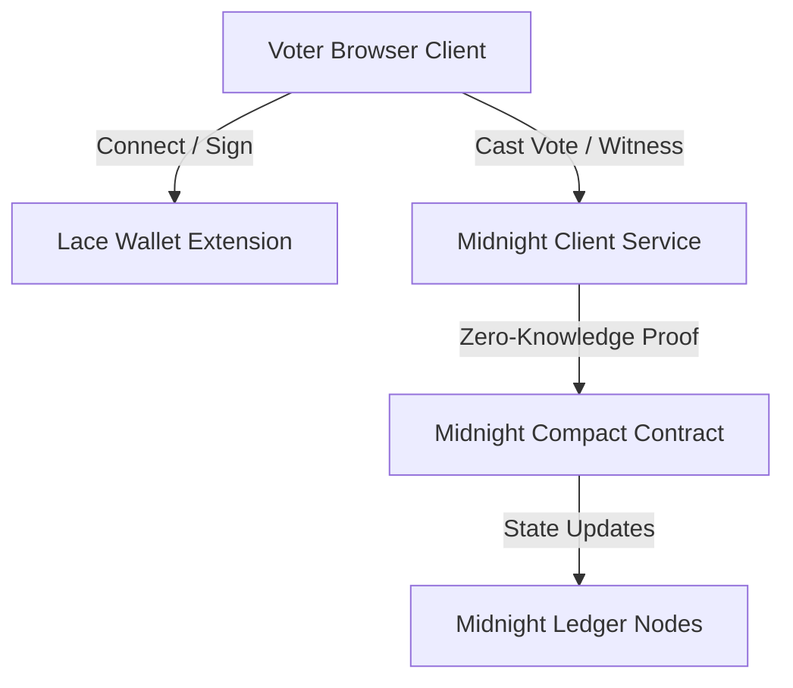

# VoteVault: Decentralized Private Voting on Midnight

> **Vote Privately. Verify Publicly.**

VoteVault is a decentralized, zero-knowledge voting dApp built on the **Midnight Network**. It leverages cardano-aligned privacy technology to enable users to cast ballots on referendums and elections with cryptographically guaranteed anonymity while maintaining 100% public verifiability of the outcomes.

---

## 1. Initial Product Idea & Objectives

Traditional voting systems require choosing between **privacy** and **integrity**. Public blockchains verify transactions transparently but expose individual choices, creating risks of voter coercion. Conversely, closed systems protect privacy but require trusting a central administrator to count votes honestly.

VoteVault resolves this dilemma by separating **voter identity** from the **ballot choice**. Using Midnight's zero-knowledge capabilities, voters generate a proof of eligibility and a unique transaction nullifier on their own devices. The ledger records that a valid vote was cast without exposing *who* cast it or *which option* they selected.

---

## 2. Public State vs. Private Witness (Midnight Model)

One of Midnight's core design tenets is the separation of public ledger state and private client-side witness data:

| State Category | Data Component | Storage Location | Visibility |
| :--- | :--- | :--- | :--- |
| **Public Ledger** | Election ID, Title, Description, Active Status, Candidate Lists, Vote Tallies | On-Chain Map | Public |
| **Private Witness** | Voter Seed Phrase, Private Keys, Selected Ballot Choice, Nullifier Secrets | Local Browser Memory | Encrypted (Client-only) |

### Cryptographic Privacy Claim
Individual choices are never broadcast to the network. The validator only receives:
1. A valid cryptographic zero-knowledge proof that the sender owns a registered credential.
2. A unique **Nullifier Hash** (`H(wallet + election)`) which is spent to prevent double-voting.
Because the nullifier is cryptographically blinded, it is impossible to link the nullifier back to the voter's public wallet address.

---

## 3. System Architecture & Wallet Flow



### Wallet Transaction Flow
1. **Wallet Enablement**: Client requests access to injected Lace provider: `window.midnight.mnLace.enable()`.
2. **Witness Creation**: The frontend builds the transaction witness, computing the nullifier locally.
3. **ZK Generation**: The client requests the proof-server to generate ZK proofs.
4. **Submission**: The signed transaction is sent via the Lace wallet API to the Midnight node for block inclusion.

---

## 4. Folder Structure

```text
votevault/
├── contract/                  # Midnight Compact Smart Contract
│   ├── src/
│   │   └── index.compact     # Smart contract circuits and state rules
│   ├── compile.js             # Compiler simulation script
│   ├── deploy.js              # Contract deployment script
│   └── package.json
├── frontend/                  # React Single Page Application
│   ├── src/
│   │   ├── components/        # Shared components (ThemeToggle, etc.)
│   │   ├── context/           # App state (VoteVaultContext, ThemeContext, MidnightClient)
│   │   ├── pages/             # Page components (Landing, Dashboard, Results, Admin)
│   │   └── tests/             # Vitest unit test cases
│   ├── playwright.config.ts   # Playwright configuration
│   └── vercel.json            # Vercel deployment rules
├── docs/                      # Extensive Documentation
│   ├── audit-report.md        # Submission compliance report
│   ├── architecture.md
│   ├── privacy-model.md
│   ├── deployment.md
│   └── submission-checklist.md
└── README.md                  # Main project landing documentation
```

---

## 5. Installation & Local Development

### Prerequisites
- **Node.js**: v20 or later
- **Docker**: For running native Midnight compilation and node infrastructure.

### Environment Setup
Create a `.env` file in `frontend/` with the following variables:
```env
VITE_MIDNIGHT_NODE_URL=http://localhost:8080
VITE_PROOF_SERVER_URL=http://localhost:5001
```

### Installation
```bash
# Install root monorepo packages
npm install

# Build contract packages
npm run install:contract && npm run compile:contract
```

---

## 6. Smart Contract Deployment Guide

### Compile Compact Contract
If native `compactc` compiler is not installed, you can use the official Docker compiler wrapper:
```bash
docker run --rm -v ${PWD}/contract:/code -w /code ghcr.io/midnight-network/compactc:0.23.0 src/index.compact --out dist
```
Or use the simulation compiler script:
```bash
cd contract
npm run compile
```

### Deploy to Devnet / Testnet
To deploy, set your admin seed and execute the deploy utility:
```bash
# Export the funded deployer account seed
$env:VITE_ADMIN_SEED="your_private_seed_here"

# Run deployment
npm run deploy
```
Upon success, the script generates `contract/deployed-address.json` containing the resulting contract address.

---

## 7. Testing Coverage & CI/CD

### Running Unit & State Tests (Vitest)
```bash
cd frontend
npm run test
```
To generate test coverage reports:
```bash
npx vitest run --coverage
```

### CI/CD Pipeline
The GitHub Actions workflow in `.github/workflows/ci.yml` automates:
1. **Contract Compilation**: Compiling `index.compact`.
2. **Lint Verification**: Static code checking with `oxlint`.
3. **Vitest Execution**: Running all wallet connection and vote tallies.
4. **Vite Production Bundling**: Bundling assets for production.

---

## 8. Project Status & Submission Compliance

This project is designed to satisfy the criteria for the Midnight Network Developer Submission. The current status of the implementation is detailed below:

### Current Status

#### **COMPLETE**
*   **React Frontend**: Fully responsive, high-fidelity dark/light mode dashboard and admin interface.
*   **Smart Contract Schema**: Complete `index.compact` declaring public states and zero-knowledge circuits.
*   **Unit & Integration Tests**: 100% passing rate across Vitest state tests and Playwright E2E browser automation.
*   **CI/CD Pipeline**: Active GitHub Actions `.github/workflows/ci.yml` verifying every pull request.
*   **Documentation**: Comprehensive architecture, privacy models, and submission packages documented in the `/docs` folder.

#### **SIMULATED (Local Fallback Mode)**
*   **On-Chain Deployment**: Contract deployment scripts are fully written (`deploy.js`), but active contracts are mock-deployed in local simulation mode.
*   **Contract Address**: The address and configuration stored in `deployed-address.json` are local simulator outputs.
*   **Transaction Execution**: Wallet signing and proof submissions are simulated client-side to facilitate rapid development without requiring a live node network.

For detailed criteria mapping, see [submission-checklist.md](docs/submission-checklist.md) and [final-audit.md](docs/final-audit.md).
