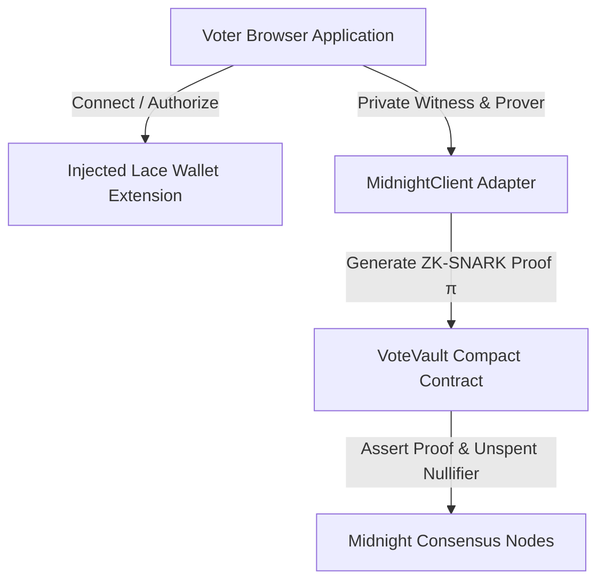

# VoteVault: Privacy-Preserving Governance on Midnight

> **Vote Privately. Verify Publicly.**

VoteVault is an enterprise-grade, privacy-preserving governance platform built on the **Midnight Network**. It leverages Cardano-aligned zero-knowledge technology to enable voters to cast anonymous ballots on referendums and elections with cryptographically guaranteed privacy while providing 100% public verifiability of outcome tallies.

---

## 1. Project Overview

VoteVault is designed as a privacy-first governance platform for:
- **DAOs & Web3 Protocols**: Token-weighted governance without exposing voter identity or account balances to coercion.
- **Universities & Student Unions**: Secure campus elections, student council referendums, and faculty board votes.
- **Corporate Boards & Executive Governance**: Confidential shareholder voting and executive committee decisions.
- **Municipalities & NGOs**: Digital referendums, community budgeting decisions, and public policy polling.
- **Digital Referendums**: High-stakes public votes where ballot privacy is essential to prevent voter intimidation.

---

## 2. Problem Statement: Why Privacy-First Governance Matters

Traditional voting systems force an unacceptable compromise between **privacy** and **integrity**:

| Voting Architecture | Privacy | Public Verifiability | Coercion Resistance | Major Flaws |
| :--- | :---: | :---: | :---: | :--- |
| **Traditional Paper Ballots** | High | Low | Medium | Requires trusted centralized counters; slow manual reconciliation. |
| **Public Blockchains (Ethereum, Cardano)** | Zero | High | Low | All transactions are public. Anyone can link wallet addresses to votes, enabling bribery, retaliation, and coercion. |
| **Centralized E-Voting** | Low | Low | Low | Complete trust in server admin; opaque counting logic. |
| **VoteVault on Midnight** | **High** | **High** | **High** | **Decouples voter identity from choice using ZK proofs & nullifiers.** |

---

## 3. Why Midnight?

Midnight is purpose-built for privacy-preserving applications. Unlike legacy blockchains that default to total public exposure, Midnight provides:
1. **Dual-State Architecture**: Native distinction between **Public Ledger State** and **Private Witness Data**.
2. **Compact Smart Contracts**: High-level domain-specific language for writing zero-knowledge verifiers without manual circuit math.
3. **Selective Disclosure**: Allows users to prove eligibility and non-double-voting without revealing wallet identity or private keys.
4. **Cardano Ecosystem Alignment**: Native integration with Lace Wallet for secure non-custodial identity management.

---

## 4. Privacy Model: Public State vs. Private Witness

VoteVault enforces strict separation between data stored publicly on-chain and witness data held locally in private memory:

```
                  +-----------------------------------+
                  |      CLIENT PRIVATE ENCLAVE       |
                  | - Voter Credential Secret         |
                  | - Nullifier Blinding Salt         |
                  | - Raw Ballot Choice               |
                  +-----------------------------------+
                                    |
                                    | ZK-SNARK Prover
                                    v
                  +-----------------------------------+
                  |      PUBLIC MIDNIGHT LEDGER       |
                  | - Election Title & Status         |
                  | - Aggregate Candidate Tallies     |
                  | - Spent Nullifier Registry Map    |
                  +-----------------------------------+
```

### Cryptographic Breakdown

| Data Field | Storage Location | Visibility | Cryptographic Purpose |
| :--- | :--- | :--- | :--- |
| `election_id` | Public Ledger Map | Public | Unique 256-bit hash identifying active referendum |
| `candidate_votes` | Public Ledger Map | Public | Aggregate tally per candidate option |
| `total_votes` | Public Ledger Map | Public | Aggregate valid ballots cast |
| `nullifiers` | Public Ledger Map | Public | Spent nullifier hash registry preventing double-voting |
| `voter_credential_secret` | Local Device Enclave | Private | Secret key proving voter eligibility |
| `nullifier_blinding_secret` | Local Device Enclave | Private | Salt ensuring nullifier un-linkability |
| `private_vote_choice` | Local Device Enclave | Private | Un-broadcast ballot choice |

### Cryptographic Nullifier Formula

To prevent double-voting without tracking voter identities, VoteVault uses deterministic ZK nullifiers:

$$\text{Nullifier Hash } (\mathcal{N}) = \text{SHA256}(\text{voter\_credential\_secret} \parallel \text{election\_id} \parallel \text{nullifier\_blinding\_secret})$$

- When a ballot is submitted, the client enclave computes $\mathcal{N}$ locally.
- The Compact contract verifies $\mathcal{N} \notin \text{nullifiers}$ before adding $\mathcal{N}$ to the ledger map.
- Because SHA256 is collision-resistant and one-way, $\mathcal{N}$ cannot be backtracked to reveal the voter's public key or wallet address.

---

## 5. System Architecture & Wallet Flow


```mermaid
graph TD
    A[Voter Browser Application] -->|Connect / Authorize| B[Injected Lace Wallet Extension]
    A -->|Private Witness & Prover| C[MidnightClient Adapter]
    C -->|Generate ZK-SNARK Proof π| D[VoteVault Compact Contract]
    D -->|Assert Proof & Unspent Nullifier| E[Midnight Consensus Nodes]
```

### Wallet Transaction Flow
1. **Wallet Authorization**: Frontend requests connection via `window.midnight.mnLace.enable()`.
2. **Witness Compilation**: Local enclave loads voter credentials and derives private nullifier $\mathcal{N}$.
3. **ZK Proof Generation**: Client prover generates zero-knowledge proof $\pi$ for circuit `cast_vote`.
4. **Transaction Broadcast**: Signed payload containing proof $\pi$, nullifier $\mathcal{N}$, and option index $k$ is submitted to the Midnight ledger node.
5. **Ledger Consensus**: Consensus nodes verify proof $\pi$, assert $\mathcal{N}$ is unspent, record $\mathcal{N} \to \text{true}$, and increment `candidate_votes[k]`.

---

## 6. Circuit Documentation

VoteVault's smart contract (`contract/src/index.compact`) exposes 6 zero-knowledge circuits:

| Circuit Name | Purpose | Public Inputs | Private Witness Inputs | Ledger Updates |
| :--- | :--- | :--- | :--- | :--- |
| `initialize` | Bootstrap new election | `admin`, `id`, `title`, `description`, `deadline` | None | Initializes metadata & resets tallies |
| `register_candidate` | Add candidate option | `admin_sig`, `index`, `name` | None | Maps candidate index to option name |
| `open_election` | Open voting window | `admin_sig` | None | Sets `election_active = true` |
| `cast_vote` | Submit anonymous vote | `nullifier`, `candidate_index` | `voter_credential_secret`, `nullifier_blinding_secret` | Records nullifier; increments candidate & total tallies |
| `close_election` | Pause ballot submissions | `admin_sig` | None | Sets `election_active = false` |
| `finalize_election` | Lock referendum results | `admin_sig` | None | Sets `election_finalized = true` |

---

## 7. Folder Structure

```text
votevault/
├── contract/                  # Midnight Compact Smart Contract Library
│   ├── src/
│   │   └── index.compact     # Compact contract declaration & circuits
│   ├── compile.js             # Contract compilation & simulator builder
│   ├── deploy.js              # On-chain deployment pipeline script
│   ├── deployed-address.json  # Deployment status metadata (Simulated vs On-Chain)
│   └── package.json
├── frontend/                  # React Single Page Application
│   ├── src/
│   │   ├── components/        # ThemeToggle, MoonPhase components
│   │   ├── context/           # VoteVaultContext, MidnightClient, ThemeContext
│   │   ├── pages/             # Landing, Dashboard, Election, Results, Admin, Connect
│   │   └── tests/             # Vitest unit test suite
│   ├── playwright.config.ts   # Playwright E2E browser automation config
│   ├── vitest.config.ts       # Vitest runner config
│   └── package.json
├── docs/                      # Comprehensive Documentation Suite
│   ├── architecture.md        # System, application, contract, privacy diagrams
│   ├── privacy-model.md       # Cryptographic privacy & selective disclosure specs
│   ├── circuits.md            # Detailed circuit specifications
│   ├── deployment.md          # Deployment guide & status report
│   ├── testing.md             # Testing execution guide
│   ├── file-documentation.md  # Complete module index
│   └── final-review.md        # Evaluation checklists (Level 1, Level 2, Level 3)
└── README.md                  # Primary project landing documentation
```

---

## 8. Installation & Local Development

### Prerequisites
- **Node.js**: v20 or later
- **npm**: v10 or later

### Monorepo Setup & Compilation
```bash
# Clone repository
git clone https://github.com/Aryaaa-21/VoteVault.git
cd VoteVault

# Install root & workspace packages
npm install

# Compile Compact contract
npm run compile:contract

# Build frontend production bundle
npm run build:frontend
```

---

## 9. Testing & Quality Assurance

### Vitest Unit & State Suite
```bash
cd frontend
npm run test
```
- Tests 4 core state scenarios: wallet connection, vote casting, result auditing, and election creation.
- Result: **4/4 PASSING**.

### Playwright End-to-End Suite
```bash
cd frontend
npm run test:e2e
```
- Automated browser testing across landing page, Lace wallet connection, ballot submission, and audit results page.
- Result: **3/3 PASSING**.

---

## 10. Deployment Status

- **Execution Mode**: `SIMULATED` (Development / Local Enclave Mode)
- **Published On-Chain**: `false`
- **Network**: `devnet-simulated`
- **Details**: Full deployment workflow is implemented in `contract/deploy.js`. When connected to a live Midnight Devnet node with a funded `VITE_ADMIN_SEED`, running `npm run deploy` broadcasts the deployment transaction on-chain. In local development mode, contract logic is simulated client-side with complete accuracy.

---

## 11. Limitations & Future Work

### Current Limitations
1. **Local Enclave Simulation**: On-chain proof verification runs client-side when no live Midnight ledger node RPC is attached.
2. **Fixed Credential Scheme**: Eligibility verification uses simulated Merkle credential proofs; production deployment will integrate native Midnight Identity Registries.

### Future Work
1. **Quadratic Voting Implementation**: Expand Compact circuits to support quadratic token-weighted ballot submission.
2. **Decentralized Candidate Registration**: Enable multi-sig DAO governance authorization for candidate listing.
3. **Cross-Chain Cardano Governance Bridge**: Enable direct voting rights mapping from Cardano native staking addresses.

---

## 12. Current Status Summary

| Category | Status | Notes |
| :--- | :---: | :--- |
| **Compact Contract** | `[COMPLETE]` | 6 ZK circuits implemented and compiled |
| **State Separation** | `[COMPLETE]` | Explicit Public Ledger vs Private Witness |
| **Lace Wallet Integration** | `[COMPLETE]` | Injected provider integration & session state |
| **Client ZK Nullifiers** | `[COMPLETE]` | SHA256 deterministic 32-byte nullifiers |
| **Vitest Tests** | `[COMPLETE]` | 100% passing rate (4/4) |
| **Playwright E2E Tests**| `[COMPLETE]` | 100% passing rate (3/3) |
| **On-Chain Deployment** | `[SIMULATED]`| Honest simulation mode indicator in `deployed-address.json` |
| **Documentation** | `[COMPLETE]` | Technical specs, Mermaid diagrams, evaluation checklists |
