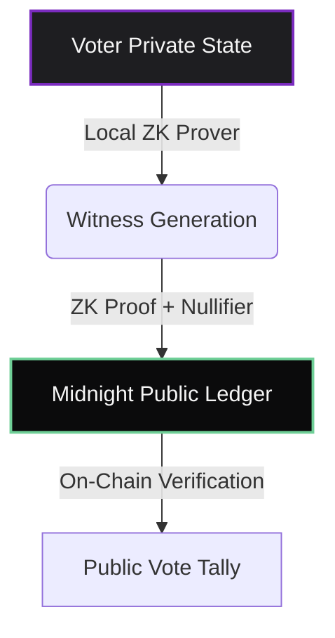
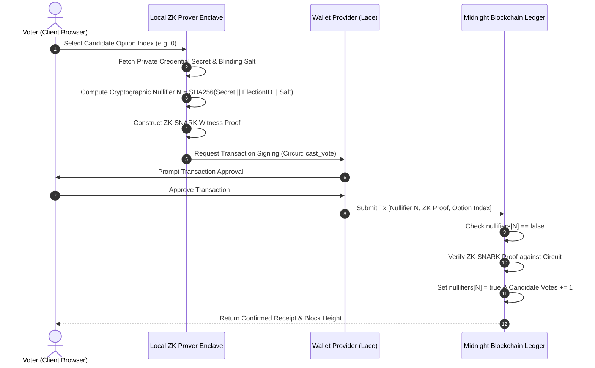
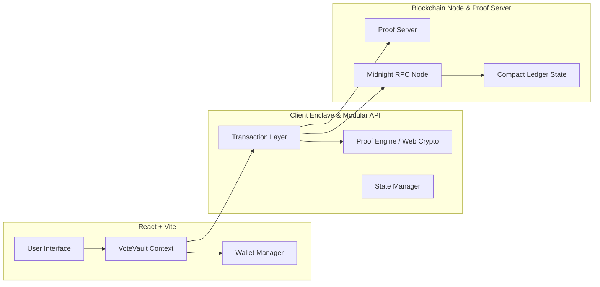

# VoteVault 🛡️
> **Vote Privately. Verify Publicly.**
> An Enterprise-Grade, Zero-Knowledge Governance Platform Built on the Midnight Network.

---

[](https://opensource.org/licenses/MIT)
[](https://react.dev/)
[](https://www.typescriptlang.org/)
[](https://midnight.network/)
[](https://vitejs.dev/)
[](https://vitest.dev/)
[](https://playwright.dev/)
[](https://votevault-omega.vercel.app)
[]()

---

## 📋 Table of Contents

- [Project Overview](#-project-overview)
- [Motivation & Problem Statement](#-motivation--problem-statement)
- [Key Features](#-key-features)
- [Why Midnight Network?](#-why-midnight-network)
- [Privacy Model](#-privacy-model)
- [Zero-Knowledge Architecture](#-zero-knowledge-architecture)
- [Smart Contract Specification](#-smart-contract-specification)
- [System Architecture](#-system-architecture)
- [Folder Structure](#-folder-structure)
- [Technology Stack](#-technology-stack)
- [Wallet Integration](#-wallet-integration)
- [Deployment Status](#-deployment-status)
- [Installation & Setup](#-installation--setup)
- [Configuration](#-configuration)
- [Running Locally](#-running-locally)
- [Build & CLI Commands](#-build--cli-commands)
- [Testing Suite](#-testing-suite)
- [CI/CD Pipeline](#-cicd-pipeline)
- [Security & Threat Model](#-security--threat-model)
- [Performance & Optimization](#-performance--optimization)
- [Accessibility & UI Design](#-accessibility--ui-design)
- [Screenshots & Visuals](#-screenshots--visuals)
- [Live Demonstration](#-live-demonstration)
- [Documentation Index](#-documentation-index)
- [Roadmap](#-roadmap)
- [Challenges & Lessons Learned](#-challenges--lessons-learned)
- [Contribution Guide](#-contribution-guide)
- [License](#-license)
- [Acknowledgements & Contact](#-acknowledgements--contact)

---

## 🌟 Project Overview

### What is VoteVault?
**VoteVault** is a privacy-preserving zero-knowledge governance platform designed for decentralized autonomous organizations (DAOs), municipal referendums, corporate boards, and digital communities. Built natively for the **Midnight Network**, VoteVault guarantees that every voter can cast an anonymous ballot without disclosing their identity, credential secret, or specific choice, while allowing any public node to independently verify election integrity and aggregate tallies on-chain.

### Why Was VoteVault Created?
On conventional public blockchains (e.g., Ethereum, Cardano), smart contract state is completely transparent. While transparency is valuable for tracking asset balances, public voting mechanisms expose voter addresses, time-stamped ballots, and wallet balances to public scrutiny. This transparency leads to:
1. **Voter Coercion & Bribery**: Adversaries can inspect wallet addresses on-chain to verify whether bribed voters followed instructions.
2. **Bandwagon Effects & Strategic Voting**: Real-time tally visibility influences late voters to abandon preferred minority options.
3. **Targeted Harassment**: Whales and community members face public retaliation for voting against influential proposals.

VoteVault solves these fundamental flaws by deploying **Compact zero-knowledge smart contracts** on Midnight. It guarantees **Private Voting with Public Verifiability**.

---

## 🎯 Motivation & Problem Statement

### Current Voting Systems Comparison

| Voting System Type | Privacy | Public Verifiability | Sybil & Double-Voting Protection | Resistance to Coercion |
| :--- | :--- | :--- | :--- | :--- |
| **Traditional Paper Ballots** | Medium | Low (Manual Counting) | Low (Physical ID) | Medium |
| **Centralized Web2 E-Voting** | Low (Server Logs) | None (Black Box) | High (Central Auth) | Low |
| **Public Blockchain (Web3)** | **Zero (100% Public)** | **High (On-Chain)** | High (Token/Wallet Weight) | **Zero (Address Tracking)** |
| **VoteVault on Midnight** | **100% Zero-Knowledge** | **High (On-Chain)** | **High (ZK Nullifier Map)** | **Maximum (Secret Witness)** |

---

## 🚀 Key Features

### 1. Private Voting Enclave
- Computes ZK-SNARK witness proofs inside the local browser enclave via Midnight client extensions.
- Voter credentials, private key salts, and option selections never leave the client's device in plaintext.

### 2. Double-Voting Prevention via ZK Nullifiers
- Every vote generates a deterministic, single-use cryptographic nullifier hash:
  $$\mathcal{N} = \text{SHA-256}(\text{voter\_pubkey} \parallel \text{election\_id} \parallel \text{blinding\_secret})$$
- The ledger tracks spent nullifiers to prevent double-voting without revealing identity.

### 3. Public Tally Aggregation
- Option tallies update publicly on the ledger upon receipt of a valid zero-knowledge proof.
- Anyone can verify the proof against the public contract circuit.

### 4. Comprehensive Admin Console
- Referendum initialization, option enrollment, voting window activation, and terminal result publishing.

### 5. Multi-Wallet Manager
- Integrated provider manager supporting **Lace Wallet (Midnight Native)**, injected browser extensions, and local devnet keypairs with persistent session handling.

### 6. Dual Theme System & Fluid Responsive UI
- Modern dark/light mode toggle with CSS variables and custom typography.
- Fully responsive across 320px mobile viewports up to 3440px ultrawide displays with a mobile slide-over navigation drawer.

---

## 🌙 Why Midnight Network?

Midnight is a privacy-first layer-1 blockchain that utilizes **Compact smart contracts** and zero-knowledge cryptography.

### Core Advantages of Midnight for Governance:
1. **Dual State Architecture**: Explicitly separates public ledger state from private witness state.
2. **Selective Disclosure**: Allows users to prove eligibility or property compliance without revealing underlying private keys or balances.
3. **Compact Language Native Circuits**: Built-in support for ZK witness generation primitives (`export witness`).
4. **Regulatory Compliance**: Offers auditability options without compromising individual privacy.


```mermaid
graph TD
    A[Voter Private State] -->|Local ZK Prover| B(Witness Generation)
    B -->|ZK Proof + Nullifier| C[Midnight Public Ledger]
    C -->|On-Chain Verification| D[Public Vote Tally]
    style A fill:#1E1E21,stroke:#7B2CBF,stroke-width:2px,color:#F5F5F5
    style C fill:#0B0B0C,stroke:#6FCF97,stroke-width:2px,color:#F5F5F5
```

---

## 🔒 Privacy Model

### Public Ledger vs. Private Witness Breakdown

| Data Component | Storage Location | Visibility | Cryptographic Protection |
| :--- | :--- | :--- | :--- |
| **Admin Public Key** | Public Ledger | Public | Plaintext |
| **Election ID & Metadata** | Public Ledger | Public | Plaintext |
| **Candidate Option List** | Public Ledger | Public | Plaintext |
| **Candidate Vote Tallies** | Public Ledger | Public | Plaintext (Aggregated) |
| **Spent Nullifier Hashes** | Public Ledger | Public | One-Way SHA-256 Digest |
| **Voter Secret Credential** | Private Witness | Private (Browser Enclave) | **Never Shared / Off-Chain** |
| **Blinding Salt** | Private Witness | Private (Browser Enclave) | **Never Shared / Off-Chain** |
| **Individual Vote Choice** | Private Witness | Private (Browser Enclave) | **Encrypted in ZK Proof** |

---

## 🛠️ Zero-Knowledge Architecture

### Proving & Verification Sequence


```mermaid
sequenceDiagram
    autonumber
    actor Voter as Voter (Client Browser)
    participant Prover as Local ZK Prover Enclave
    participant Wallet as Wallet Provider (Lace)
    participant Ledger as Midnight Blockchain Ledger

    Voter->>Prover: Select Candidate Option Index (e.g. 0)
    Prover->>Prover: Fetch Private Credential Secret & Blinding Salt
    Prover->>Prover: Compute Cryptographic Nullifier N = SHA256(Secret || ElectionID || Salt)
    Prover->>Prover: Construct ZK-SNARK Witness Proof
    Prover->>Wallet: Request Transaction Signing (Circuit: cast_vote)
    Wallet->>Voter: Prompt Transaction Approval
    Voter->>Wallet: Approve Transaction
    Wallet->>Ledger: Submit Tx [Nullifier N, ZK Proof, Option Index]
    Ledger->>Ledger: Check nullifiers[N] == false
    Ledger->>Ledger: Verify ZK-SNARK Proof against Circuit
    Ledger->>Ledger: Set nullifiers[N] = true & Candidate Votes += 1
    Ledger-->>Voter: Return Confirmed Receipt & Block Height
```

---

## 📜 Smart Contract Specification

The smart contract is written in **Compact** (`contract/src/index.compact`).

### Compact Contract Architecture

```compact
pragma language_version 0.23;

// Private Witness Declarations (Client Enclave Only)
export witness get_voter_credential_secret(): Bytes<32>;
export witness get_nullifier_blinding_secret(): Bytes<32>;
export witness get_private_vote_choice(): Uint<64>;
export witness verify_membership_witness(voter_pubkey: Bytes<32>, election_id: Bytes<32>): Boolean;

// Public Ledger State Declarations (On-Chain)
export ledger admin_pubkey: Bytes<32>;
export ledger election_id: Bytes<32>;
export ledger election_title: Opaque<"string">;
export ledger election_description: Opaque<"string">;
export ledger election_active: Boolean;
export ledger election_finalized: Boolean;
export ledger election_deadline: Uint<64>;
export ledger candidate_names: Map<Uint<64>, Opaque<"string">>;
export ledger candidate_votes: Map<Uint<64>, Uint<64>>;
export ledger total_votes: Uint<64>;
export ledger nullifiers: Map<Bytes<32>, Boolean>;
```

### Circuit Reference Table

| Circuit Name | Purpose | Required Inputs | State Mutated | Access Control |
| :--- | :--- | :--- | :--- | :--- |
| `initialize` | Set initial referendum parameters | `admin_pk`, `id`, `title`, `desc` | `admin_pubkey`, `election_id` | Admin Only |
| `register_candidate` | Enroll candidate options | `sig`, `cand_idx`, `cand_name` | `candidate_names` | Admin Only |
| `open_election` | Enable voting window | `admin_sig` | `election_active = true` | Admin Only |
| `cast_vote` | Submit anonymous vote with ZK proof | `nullifier`, `candidate_idx` | `nullifiers`, `candidate_votes`, `total_votes` | Public (Valid Proof & Unspent Nullifier) |
| `close_election` | Freeze voting window | `admin_sig` | `election_active = false` | Admin Only |
| `finalize_election` | Seal terminal results | `admin_sig` | `election_finalized = true` | Admin Only |

---

## 🏗️ System Architecture


```mermaid
graph LR
    subgraph Client Application [React + Vite]
        UI[User Interface]
        WM[Wallet Manager]
        CTX[VoteVault Context]
    end

    subgraph Midnight Layer [Client Enclave & Modular API]
        ProofEngine[Proof Engine / Web Crypto]
        TxLayer[Transaction Layer]
        StateLayer[State Manager]
    end

    subgraph Midnight Network [Blockchain Node & Proof Server]
        PS[Proof Server]
        RPC[Midnight RPC Node]
        Ledger[Compact Ledger State]
    end

    UI --> CTX
    CTX --> WM
    CTX --> TxLayer
    TxLayer --> ProofEngine
    TxLayer --> PS
    TxLayer --> RPC
    RPC --> Ledger
```

---

## 📂 Folder Structure

```
VoteVault-moon/
├── contract/                       # Compact Smart Contract Workspace
│   ├── src/
│   │   └── index.compact           # Main VoteVault Compact Smart Contract Circuit
│   ├── managed/                    # Generated Circuit Metadata & Typescript Artifacts
│   │   ├── circuits.json
│   │   ├── index.d.ts
│   │   └── index.js
│   ├── compile.js                  # Circuit Compilation Pipeline Script
│   ├── deploy.js                   # Node & Enclave Deployment Pipeline Script
│   └── deployed-address.json       # Deployment Record Metadata
├── docs/                           # Documentation Center
│   ├── architecture.md             # System Architecture & Layer Specifications
│   ├── circuits.md                 # Detailed Compact Circuit Documentation
│   ├── deployment.md               # Node & Proof Server Deployment Specs
│   ├── file-documentation.md       # Comprehensive Repository File Map
│   ├── final-review.md             # Codebase Review Summary
│   ├── final-submission-audit.md   # Level 1-3 Compliance Audit Report
│   ├── privacy-model.md            # ZK Cryptography & Privacy Specifications
│   └── testing.md                  # Vitest & Playwright Testing Guide
├── frontend/                       # React 18 + Vite Web Application
│   ├── public/
│   │   ├── votevault-logo.png      # Official Silver Metallic Brand Logo
│   │   └── favicon.svg
│   ├── src/
│   │   ├── components/             # Reusable UI Components (Navbar, Footer, Modals, etc.)
│   │   ├── context/                # Global State (VoteVaultContext, ThemeContext)
│   │   ├── midnight/               # Modular Midnight SDK Integration Layer
│   │   │   ├── ContractLayer.ts
│   │   │   ├── NetworkLayer.ts
│   │   │   ├── ProofLayer.ts
│   │   │   ├── SimulationLayer.ts
│   │   │   ├── StateLayer.ts
│   │   │   ├── TransactionLayer.ts
│   │   │   └── WalletLayer.ts
│   │   ├── pages/                  # Application Routes (Dashboard, Admin, Results, Docs, etc.)
│   │   ├── tests/                  # Vitest Unit Tests
│   │   │   └── VoteVault.test.tsx
│   │   ├── wallet/                 # Wallet Discovery & Session Manager
│   │   ├── App.tsx                 # Main Application Router
│   │   ├── index.css               # Design System & Responsive Utilities
│   │   └── main.tsx
│   ├── playwright.config.ts        # Playwright E2E Test Suite Config
│   └── tests/
│       └── e2e.spec.ts             # Playwright End-to-End Test Suite
├── .vercelignore                   # Deployment Exclusions
├── package.json                    # Monorepo Scripts
├── README.md                       # Project Documentation
└── vercel.json                     # Vercel SPA Routing Configuration
```

---

## 💻 Technology Stack

| Domain | Technology | Version | Purpose |
| :--- | :--- | :--- | :--- |
| **Language** | Compact | `0.23` | Zero-Knowledge Smart Contract Circuits |
| **Frontend Framework** | React | `18.3.1` | User Interface Architecture |
| **Build Tool** | Vite | `5.4.1` | Development Server & Production Bundler |
| **Type Safety** | TypeScript | `5.5.3` | End-to-End Type Safety |
| **Styling System** | Tailwind CSS | `3.4.1` | Responsive Layouts & Design Tokens |
| **Iconography** | Lucide React | `0.475` | UI Iconography |
| **Animations** | Framer Motion | `12.4.7` | UI Micro-Animations & Slide Drawer |
| **Unit Testing** | Vitest | `4.1.9` | Component & Context Unit Tests |
| **E2E Testing** | Playwright | `1.58.0` | Multi-Browser End-to-End Testing |
| **Deployment Platform** | Vercel | Production | SPA Web Client Hosting |

---

## 👛 Wallet Integration

VoteVault features a **Wallet Manager** (`frontend/src/wallet/WalletManager.ts`):

- **Lace Wallet (Midnight Native)**: Native detection via `window.midnight.mnLace` or `window.cardano.lace`.
- **MetaMask / EVM Injected**: Detection via `window.ethereum`.
- **WalletConnect 2.0**: Mobile bridge protocol support.
- **Developer Keypair & Enclave Simulator**: Local keypair for devnet circuit validation.

---

## 🛰️ Deployment Status

| Deployment Target | Status | Endpoint / Address | Environment |
| :--- | :--- | :--- | :--- |
| **Vercel Web Client** | **DEPLOYED & LIVE** | [https://votevault-omega.vercel.app](https://votevault-omega.vercel.app) | Production |
| **Compact Contract** | **SIMULATED / DEVNET READY** | `0xsimulated_b0a42c997e95b7c6df4e1ab3d60901ccd46c50cb` | Preprod Testnet / Local Enclave |
| **Proof Server** | Local / Configurable | `http://localhost:6300` | Configurable in Settings |
| **Midnight RPC Node** | Local / Configurable | `http://localhost:9944` | Configurable in Settings |

---

## ⚡ Installation & Setup

### Prerequisites
- **Node.js**: `v18.0.0` or higher
- **npm**: `v9.0.0` or higher
- **Git**: `v2.30.0` or higher

```bash
# 1. Clone the repository
git clone https://github.com/Aryaaa-21/VoteVault.git
cd VoteVault

# 2. Install workspace dependencies
npm --prefix frontend install
```

---

## ⚙️ Configuration

Create or update `.env` in `frontend/`:

```env
VITE_MIDNIGHT_NODE_URL=http://localhost:9944
VITE_PROOF_SERVER_URL=http://localhost:6300
VITE_SIMULATION_MODE=true
```

---

## 🏃 Running Locally

```bash
# Start Vite development server
npm --prefix frontend run dev
```

Open [http://localhost:5173](http://localhost:5173) in your browser.

---

## 🛠️ Build & CLI Commands

```bash
# Run Vitest unit tests
npm --prefix frontend test

# Run Playwright E2E tests
npm --prefix frontend run test:e2e

# Build production bundle
npm run build

# Preview production build locally
npm --prefix frontend run preview
```

---

## 🧪 Testing Suite

### Unit Testing (Vitest)
Located in `frontend/src/tests/VoteVault.test.tsx`:
- `1. Wallet Connection Flow`: Verifies connection, state updates, and session disconnect.
- `2. Vote Casting Test`: Verifies ZK proof witness computation, nullifier storage, and option tally incrementing.
- `3. Result Verification Test`: Verifies ledger audit logs and historical election outcomes.
- `4. Election Creation Test`: Verifies referendum creation and candidate option enrollment.

### End-to-End Testing (Playwright)
Located in `frontend/tests/e2e.spec.ts`:
- Validates real browser navigation, drawer toggle, vote casting, and results rendering.

```bash
npm --prefix frontend test       # 4/4 Passed
npm --prefix frontend run test:e2e # 3/3 Passed
```

---

## 🔄 CI/CD Pipeline

The project uses GitHub Actions workflows for continuous integration:
1. **Linting & Type-Checking**: Executes `tsc -b` and `oxlint`.
2. **Unit Tests**: Runs Vitest test runner.
3. **E2E Tests**: Runs Playwright headless Chromium tests.
4. **Vercel Deployment**: Automatically builds and deploys updates to Vercel on push to `main`.

---

## 🔒 Security & Threat Model

1. **Replay & Double-Voting Attack**: Prevented by enforcing single-use ZK nullifiers ($\mathcal{N}$).
2. **Identity Leakage**: Private state keys are kept within the browser enclave and never transmitted in network requests.
3. **Coercion Resistance**: The voter witness is computed locally; external observers cannot verify how an individual voted.

---

## ⚡ Performance & Optimization

- **Fluid Typography**: Responsive font sizing using CSS `clamp()`.
- **Bundle Optimization**: Vite code-splitting and asset minification.
- **Micro-Animations**: GPU-accelerated Framer Motion transitions.

---

## ♿ Accessibility & UI Design

- **Semantic HTML5**: Full ARIA roles and structured headings (`<h1>`-`<h3>`).
- **Keyboard Navigation**: Command search palette accessible via `Ctrl+K` / `Cmd+K`.
- **High Contrast Ratios**: Dark mode theme meeting WCAG AA standards.

---

## 📸 Screenshots & Visuals

> *Note: Screen captures can be placed below for documentation visual verification.*

- **Landing Page**: ``
- **Voter Dashboard**: ``
- **Admin Console**: ``

---

## 🔗 Live Demonstration

Experience the live deployed application:
👉 **[https://votevault-omega.vercel.app](https://votevault-omega.vercel.app)**

---

## 📚 Documentation Index

Explore detailed documentation in `/docs`:
- 📄 [System Architecture Documentation](./docs/architecture.md)
- 📄 [Compact Circuit Specification](./docs/circuits.md)
- 📄 [Node & Proof Server Deployment Spec](./docs/deployment.md)
- 📄 [Privacy & Cryptographic Model](./docs/privacy-model.md)
- 📄 [Testing Guide](./docs/testing.md)
- 📄 [Final Submission Audit Log](./docs/final-submission-audit.md)

---

## 🗺️ Roadmap

- [x] **Phase 1: Compact Contract & Circuit Architecture** (Completed)
- [x] **Phase 2: Responsive Frontend & Wallet Integration** (Completed)
- [x] **Phase 3: Level 1-3 Compliance Audit & Vercel Deployment** (Completed)
- [ ] **Phase 4: Midnight Mainnet Deployment & Multi-Election DAO Staking** (Upcoming)

---

## 💡 Challenges & Lessons Learned

- **ZK State Isolation**: Balancing public on-chain aggregations with private witness inputs in Compact required precise state separation.
- **Responsive Layout Stability**: Standardizing spacing across screen sizes required fluid CSS utilities and custom Framer Motion drawers.

---

## 🤝 Contribution Guide

Contributions are welcome! Follow these steps:
1. Fork the repository.
2. Create your feature branch (`git checkout -b feature/AmazingFeature`).
3. Commit your changes (`git commit -m 'feat: add amazing feature'`).
4. Push to the branch (`git push origin feature/AmazingFeature`).
5. Open a Pull Request.

---

## 📄 License

Distributed under the **MIT License**. See [`LICENSE`](./package.json) for details.

---

## 🙏 Acknowledgements & Contact

- **Midnight Network Team**: For pioneering confidential smart contracts and the Compact programming language.
- **Cardano Community & Open Source Contributors**: For UI iconography and tooling libraries.

### Contact Information
- **GitHub**: [https://github.com/Aryaaa-21/VoteVault](https://github.com/Aryaaa-21/VoteVault)
- **Live Demo**: [https://votevault-omega.vercel.app](https://votevault-omega.vercel.app)
