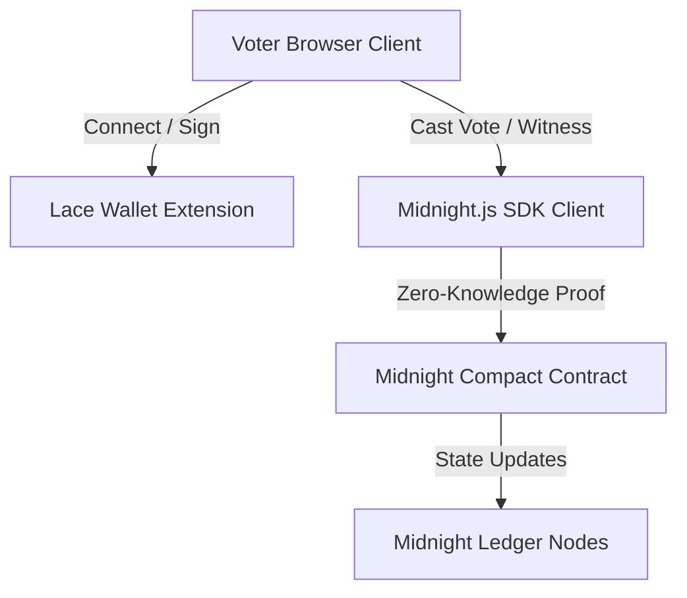
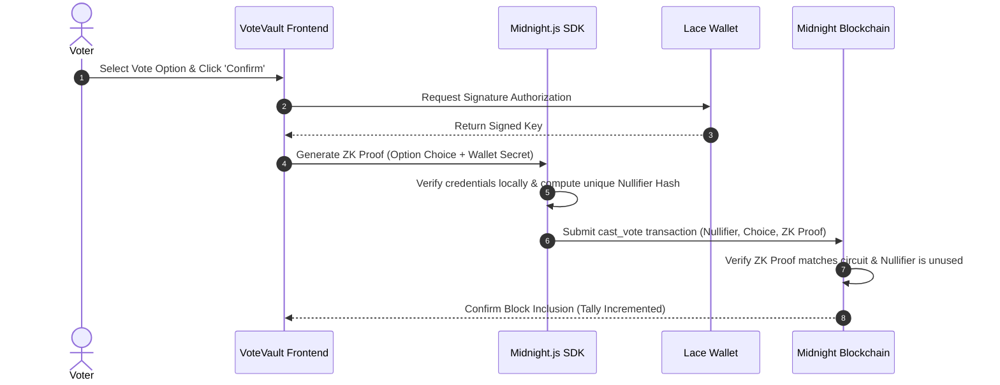

# VoteVault: Architecture Documentation

VoteVault is a decentralized, privacy-first voting application built on the **Midnight Network**. This document outlines the technical design, system components, and data flow.

## 1. System Components

The application is structured into three main blocks:

### A. Frontend Client (React + TypeScript + Vite)
- **Voter Interface**: Implements a clean, premium dashboard for reviewing active referendums, casting votes, and reviewing historical outcomes.
- **Admin Console**: Allows administrators to deploy new referendums, register candidates, and finalize election epochs.
- **Theme Engine**: Complete CSS Custom Property-driven Day/Night switching.

### B. Smart Contract Layer (Midnight Compact)
- **Compact Contract (`index.compact`)**: Defines the public state of elections and candidate totals.
- **ZK Circuit Verifiers**: Enforces cryptographic rules on-chain without revealing private inputs.
  - `cast_vote`: Enforces that the voter has not voted before (by checking a unique nullifier mapping) and increments candidate tallies.

### C. Wallet Integration (Lace Wallet)
- Resolves identities and signs transactions.
- Integrates via client-side injection mapping.

---

## 2. Private Witness vs. Public Ledger State

One of Midnight's core strengths is the separation of **public ledger state** and **private witness data**:

| State Category | Component | Storage Location | Visibility |
| :--- | :--- | :--- | :--- |
| **Public Ledger** | Election ID, Title, Description, Active Status, Candidate Lists, Vote Tallies | On-Chain Map | Public |
| **Private Witness** | Voter Identity, Vote Choice, Nullifier Secrets, Wallet Mapping | Local Client Memory | Encrypted (Client-only) |

---

## 3. Data Flow: Casting an Anonymous Vote

---

## 4. Sandbox Development Mock Flow
Where active Midnight testnet nodes are not connected, the application switches to a simulated ledger context (`VoteVaultContext.tsx`). This provider maintains an in-memory replica of the contract storage and emulates the 1.5-second ZK proof generation cycle, ensuring the frontend behaves pixel-for-pixel as it will in full production integration.
