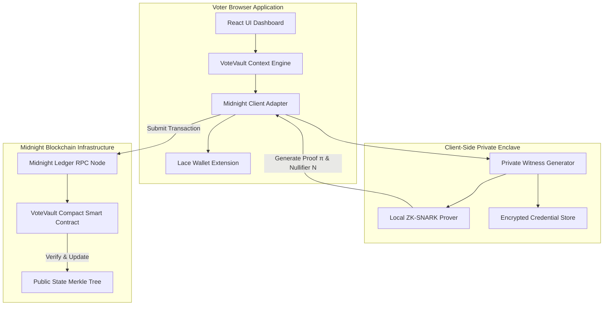
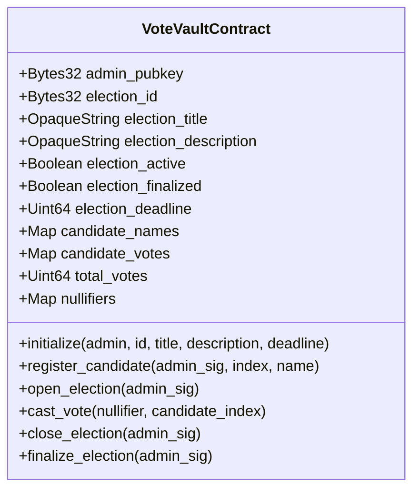
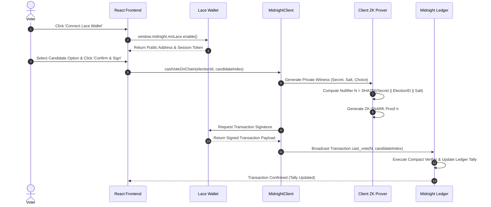
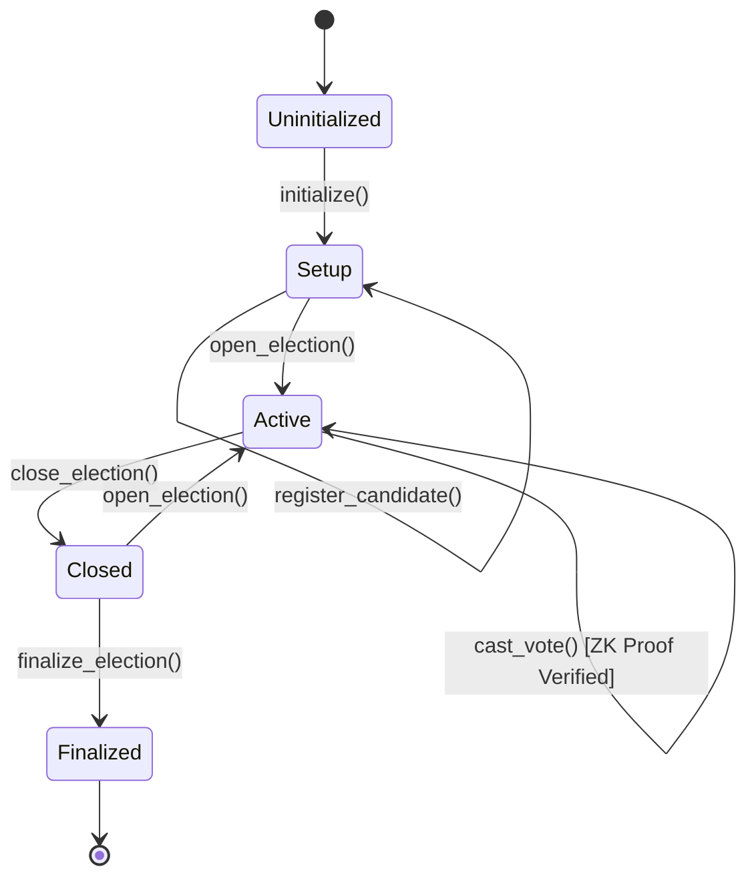

# VoteVault: Complete Architecture & System Design

VoteVault is a privacy-preserving governance platform built on the **Midnight Network**. This document details the complete system architecture, application design, smart contract topology, and zero-knowledge data flows.

---

## 1. System Architecture


```mermaid
graph TD
    subgraph Client Layer [Voter Browser Application]
        UI[React UI Dashboard]
        Context[VoteVault Context Engine]
        SDK[Midnight Client Adapter]
        Lace[Lace Wallet Extension]
    end

    subgraph Enclave Layer [Client-Side Private Enclave]
        WitnessGen[Private Witness Generator]
        ZKProver[Local ZK-SNARK Prover]
        SecretStore[Encrypted Credential Store]
    end

    subgraph Blockchain Layer [Midnight Blockchain Infrastructure]
        Node[Midnight Ledger RPC Node]
        CompactContract[VoteVault Compact Smart Contract]
        LedgerState[Public State Merkle Tree]
    end

    UI --> Context
    Context --> SDK
    SDK --> Lace
    SDK --> WitnessGen
    WitnessGen --> SecretStore
    WitnessGen --> ZKProver
    ZKProver -->|Generate Proof π & Nullifier N| SDK
    SDK -->|Submit Transaction| Node
    Node --> CompactContract
    CompactContract -->|Verify & Update| LedgerState
```

---

## 2. Application Architecture

VoteVault operates as a **Frontend-Only, Zero-Backend Architecture**. All computations, cryptographic key management, and state syncing occur directly between the React client, Lace Wallet, and Midnight ledger node:

```
frontend/
├── src/
│   ├── components/
│   │   ├── ThemeToggle.tsx       # CSS Custom Property Day/Night engine
│   │   └── MoonPhase.tsx         # Midnight lunar animation widget
│   ├── context/
│   │   ├── VoteVaultContext.tsx  # Global state manager & contract instance registry
│   │   ├── MidnightClient.ts     # Midnight.js SDK & Lace Wallet RPC bridge
│   │   └── ThemeContext.tsx      # Application theme provider
│   ├── pages/
│   │   ├── LandingPage.tsx       # Public marketing & feature overview
│   │   ├── VoterDashboard.tsx    # Active referendum list & ballot status
│   │   ├── ElectionPage.tsx     # ZK ballot casting interface
│   │   ├── ResultsPage.tsx      # Public ledger audit & verification page
│   │   ├── AdminConsole.tsx     # Proposal creation & lifecycle management
│   │   └── ConnectWalletPage.tsx# Lace Wallet authorization page
│   └── tests/
│       └── VoteVault.test.tsx    # Vitest component & context unit tests
```

---

## 3. Compact Smart Contract Architecture

The smart contract (`contract/src/index.compact`) governs election lifecycles and enforces zero-knowledge validation rules:


```mermaid
classDiagram
    class VoteVaultContract {
        +Bytes32 admin_pubkey
        +Bytes32 election_id
        +OpaqueString election_title
        +OpaqueString election_description
        +Boolean election_active
        +Boolean election_finalized
        +Uint64 election_deadline
        +Map candidate_names
        +Map candidate_votes
        +Uint64 total_votes
        +Map nullifiers
        +initialize(admin, id, title, description, deadline)
        +register_candidate(admin_sig, index, name)
        +open_election(admin_sig)
        +cast_vote(nullifier, candidate_index)
        +close_election(admin_sig)
        +finalize_election(admin_sig)
    }
```

---

## 4. Privacy Architecture & Selective Disclosure

```mermaid
graph LR
    subgraph Private Inputs [Local Private Memory]
        A[Voter Private Key]
        B[Blinding Salt]
        C[Ballot Choice]
    end

    subgraph ZK Circuit [Compact ZK Circuit]
        D{Eligibility Verifier}
        E{Nullifier Derivation}
        F{Choice Boundary Check}
    end

    subgraph Public Output [Midnight Ledger]
        G[Nullifier Hash Hash(A||ID||B)]
        H[Aggregated Candidate Tally +1]
    end

    A --> D
    A --> E
    B --> E
    C --> F
    D -->|Valid| E
    E -->|Output Only N| G
    F -->|Output Only +1| H
```

---

## 5. Wallet & Transaction Execution Flow


```mermaid
sequenceDiagram
    autonumber
    actor Voter
    participant UI as React Frontend
    participant Lace as Lace Wallet
    participant SDK as MidnightClient
    participant Prover as Client ZK Prover
    participant Node as Midnight Ledger

    Voter->>UI: Click 'Connect Lace Wallet'
    UI->>Lace: window.midnight.mnLace.enable()
    Lace-->>UI: Return Public Address & Session Token
    Voter->>UI: Select Candidate Option & Click 'Confirm & Sign'
    UI->>SDK: castVoteOnChain(electionId, candidateIndex)
    SDK->>Prover: Generate Private Witness (Secret, Salt, Choice)
    Prover->>Prover: Compute Nullifier N = SHA256(Secret || ElectionID || Salt)
    Prover->>Prover: Generate ZK-SNARK Proof π
    SDK->>Lace: Request Transaction Signature
    Lace-->>SDK: Return Signed Transaction Payload
    SDK->>Node: Broadcast Transaction cast_vote(N, candidateIndex)
    Node->>Node: Execute Compact Verifier & Update Ledger Tally
    Node-->>UI: Transaction Confirmed (Tally Updated)
```

---

## 6. Circuit Execution Flow

```mermaid
flowchart TD
    Start([Call Circuit: cast_vote]) --> CheckActive{Is Election Active?}
    CheckActive -- No --> Reject1[Revert: Election Not Active]
    CheckActive -- Yes --> CheckFinalized{Is Election Finalized?}
    CheckFinalized -- Yes --> Reject2[Revert: Election Finalized]
    CheckFinalized -- No --> CheckNullifier{Is Nullifier Spent?}
    CheckNullifier -- Yes --> Reject3[Revert: Double Voting Detected]
    CheckNullifier -- No --> MarkNullifier[Set nullifiers[nullifier] = true]
    MarkNullifier --> IncCandidate[Increment candidate_votes[candidate_index] += 1]
    IncCandidate --> IncTotal[Increment total_votes += 1]
    IncTotal --> Finish([Commit State Change to Block])
```

---

## 7. State Machine Transition Flow


```mermaid
stateDiagram-v2
    [*] --> Uninitialized
    Uninitialized --> Setup: initialize()
    Setup --> Setup: register_candidate()
    Setup --> Active: open_election()
    Active --> Active: cast_vote() [ZK Proof Verified]
    Active --> Closed: close_election()
    Closed --> Active: open_election()
    Closed --> Finalized: finalize_election()
    Finalized --> [*]
```
