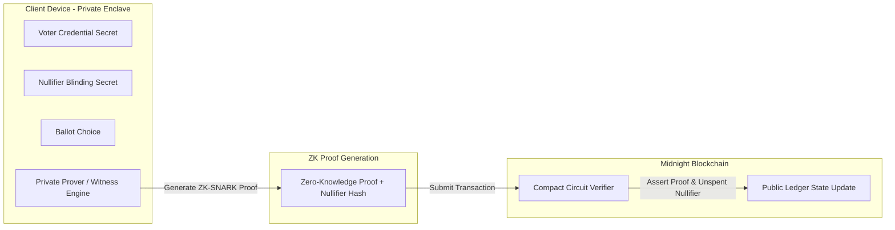

# VoteVault: Compact Contract Circuit Documentation

This document provides a detailed technical specification of every zero-knowledge circuit defined in the VoteVault Midnight Compact contract (`contract/src/index.compact`).

---

## 1. Circuit Overview & Execution Model

In the Midnight Network architecture:
- **Circuits** execute state transformations validated by zero-knowledge proofs (ZK-SNARKs).
- **Private Witness Inputs** are provided off-chain by the client's local witness generator (Lace Wallet / Midnight JS Private State Manager) and never committed to the public ledger.
- **Public Inputs** are broadcast to consensus nodes and stored in the public state tree upon proof verification.



---

## 2. Individual Circuit Specifications

### Circuit 1: `initialize`

```compact
export circuit initialize(
    admin: Bytes<32>,
    id: Bytes<32>,
    title: Opaque<"string">,
    description: Opaque<"string">,
    deadline: Uint<64>
): []
```

- **Purpose**: Instantiates a new governance referendum contract and registers administrator authorization.
- **Public Inputs**:
  - `admin`: 32-byte public key hash of the election administrator.
  - `id`: 32-byte unique identifier for the referendum (`Bytes<32>`).
  - `title`: Human-readable election title.
  - `description`: Detailed proposal or referendum text.
  - `deadline`: Unix block timestamp after which ballot submissions expire.
- **Private Witness Inputs**: None (Initialization is an open administrative bootstrap operation).
- **State Updates**:
  - Sets `admin_pubkey = admin`
  - Sets `election_id = id`
  - Sets `election_title = title`
  - Sets `election_description = description`
  - Sets `election_deadline = deadline`
  - Sets `election_active = false`
  - Sets `election_finalized = false`
  - Sets `total_votes = 0`
- **Privacy Guarantees**: Public metadata initialization.
- **Expected Output**: Contract initialized in setup state (`election_active = false`).
- **Security Considerations**: Callable only once during contract deployment.

---

### Circuit 2: `register_candidate`

```compact
export circuit register_candidate(
    admin_sig: Bytes<64>,
    index: Uint<64>,
    name: Opaque<"string">
): []
```

- **Purpose**: Registers a candidate option or referendum ballot choice prior to opening voting.
- **Public Inputs**:
  - `admin_sig`: 64-byte Ed25519 admin signature authorizing option registration.
  - `index`: 64-bit unsigned integer candidate index (e.g. 0, 1, 2).
  - `name`: Candidate name or proposal option text.
- **Private Witness Inputs**: None (Candidate options are public metadata).
- **State Updates**:
  - Sets `candidate_names[index] = name`
  - Sets `candidate_votes[index] = 0`
- **Privacy Guarantees**: Candidate names are public to enable voters to inspect options on-chain.
- **Expected Output**: Candidate entry registered with zero starting votes.
- **Security Considerations**: Must enforce `assert !election_finalized`. Requires valid admin signature.

---

### Circuit 3: `open_election`

```compact
export circuit open_election(admin_sig: Bytes<64>): []
```

- **Purpose**: Transitions the election lifecycle from setup to active voting epoch.
- **Public Inputs**:
  - `admin_sig`: 64-byte signature authorizing state transition.
- **Private Witness Inputs**: None.
- **State Updates**:
  - Sets `election_active = true`
- **Privacy Guarantees**: Public lifecycle state update.
- **Expected Output**: Voting opened for anonymous ballot submissions.
- **Security Considerations**: Must assert `!election_finalized`. Rejects non-admin signatures.

---

### Circuit 4: `cast_vote`

```compact
export circuit cast_vote(
    nullifier: Bytes<32>,
    candidate_index: Uint<64>
): []
```

- **Purpose**: Casts an anonymous zero-knowledge ballot for a selected candidate option while recording a unique spent nullifier to prevent double-voting.
- **Public Inputs**:
  - `nullifier`: 32-byte deterministic spent nullifier hash:
    $$\text{Nullifier} = \text{SHA256}(\text{voter\_credential\_secret} \parallel \text{election\_id} \parallel \text{nullifier\_blinding\_secret})$$
  - `candidate_index`: 64-bit candidate index choice.
- **Private Witness Inputs** (Computed off-chain in ZK Enclave via `witness` functions):
  - `voter_credential_secret`: Private key proving voter membership.
  - `nullifier_blinding_secret`: Client salt providing un-linkability.
  - `verify_membership_witness()`: Proves voter is in eligible merkle tree/credential registry.
- **State Updates**:
  - Enforces `assert election_active`
  - Enforces `assert !election_finalized`
  - Enforces `assert !nullifiers[nullifier]` (double-voting check)
  - Sets `nullifiers[nullifier] = true`
  - Increments `candidate_votes[candidate_index] += 1`
  - Increments `total_votes += 1`
- **Privacy Guarantees**:
  - **Identity Privacy**: Voter wallet address/public key is completely omitted from transaction inputs and outputs.
  - **Choice Unlinkability**: The nullifier hash cannot be mathematically linked back to the voter's identity or wallet address due to the one-way collision-resistant hash function.
  - **Public Auditability**: Aggregate candidate totals are updated transparently without exposing individual ballot-to-address links.
- **Expected Output**: Vote tallied, nullifier registered, total incremented.
- **Security Considerations**:
  - Prevents double-voting via on-chain nullifier map lookup.
  - Prevents voting on inactive or finalized elections.

---

### Circuit 5: `close_election`

```compact
export circuit close_election(admin_sig: Bytes<64>): []
```

- **Purpose**: Pauses ballot submissions at the conclusion of the voting window.
- **Public Inputs**:
  - `admin_sig`: 64-byte administrator authorization signature.
- **Private Witness Inputs**: None.
- **State Updates**:
  - Sets `election_active = false`
- **Privacy Guarantees**: Public lifecycle state update.
- **Expected Output**: Voting paused; no further ballots accepted.
- **Security Considerations**: Admin authorized.

---

### Circuit 6: `finalize_election`

```compact
export circuit finalize_election(admin_sig: Bytes<64>): []
```

- **Purpose**: Permanently locks referendum state and certifies final election results on-chain.
- **Public Inputs**:
  - `admin_sig`: 64-byte administrator authorization signature.
- **Private Witness Inputs**: None.
- **State Updates**:
  - Sets `election_active = false`
  - Sets `election_finalized = true`
- **Privacy Guarantees**: Final tallies become immutably locked and publicly verifiable forever.
- **Expected Output**: Election finalized; contract state permanently frozen.
- **Security Considerations**: Finalization is terminal and irreversible.
