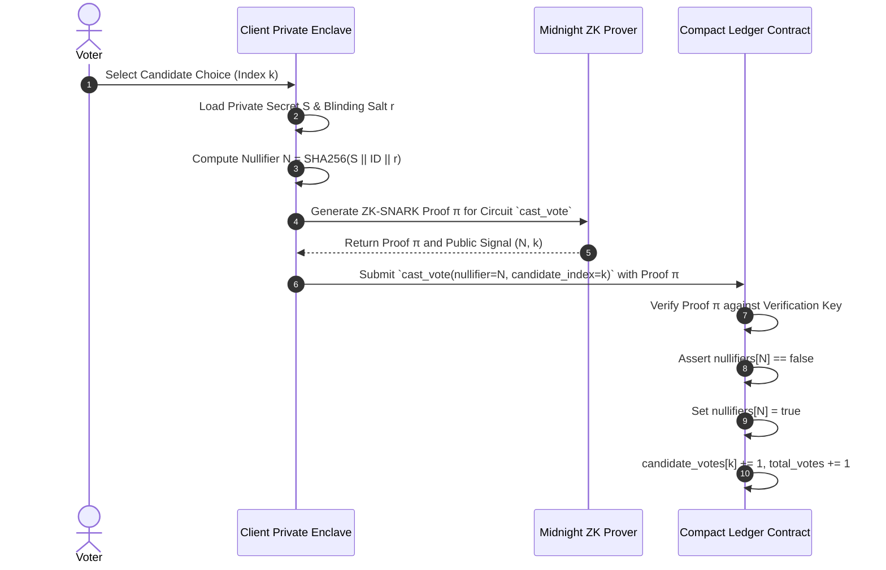

# VoteVault: Technical Privacy Model & Zero-Knowledge Architecture

This document provides a comprehensive cryptographic explanation of how VoteVault leverages the **Midnight Network** and **Compact Smart Contracts** to achieve privacy-preserving governance.

---

## 1. Midnight State Separation Model

Unlike traditional public blockchains (where all transaction inputs, outputs, and state variables are fully exposed), Midnight introduces a dual-state execution paradigm:

$$\text{Midnight State Space} = \text{Public Ledger State } (\mathcal{L}) \;\cup\; \text{Private Witness State } (\mathcal{W})$$

### A. Public Ledger State ($\mathcal{L}$)
Stored on-chain across consensus nodes in a verifiable public Merkle tree. Fully auditable by any network participant:

| Ledger Variable | Type | Description |
| :--- | :--- | :--- |
| `admin_pubkey` | `Bytes<32>` | Administrator public key hash authorizing state transitions |
| `election_id` | `Bytes<32>` | Unique 256-bit hash identifier for the referendum |
| `election_title` | `Opaque<"string">` | Referendum title metadata |
| `election_description` | `Opaque<"string">` | Referendum proposal text |
| `election_active` | `Boolean` | Open status flag permitting ballot submission |
| `election_finalized` | `Boolean` | Terminal status flag locking election tallies |
| `election_deadline` | `Uint<64>` | Unix timestamp boundary for ballot acceptance |
| `candidate_names` | `Map<Uint<64>, Opaque<"string">>` | Map of option indices to candidate names |
| `candidate_votes` | `Map<Uint<64>, Uint<64>>` | Map of candidate indices to aggregate vote counts |
| `total_votes` | `Uint<64>` | Total valid ballots cast |
| `nullifiers` | `Map<Bytes<32>, Boolean>` | Spent ZK nullifier registry preventing double-voting |

### B. Private Witness State ($\mathcal{W}$)
Processed exclusively inside the voter's local device enclave (Lace Wallet / Midnight JS Private State Manager). Never transmitted over the wire or stored on-chain:

| Witness Variable | Type | Cryptographic Role |
| :--- | :--- | :--- |
| `voter_credential_secret` | `Bytes<32>` | Private key proving voter membership in eligible set |
| `nullifier_blinding_secret` | `Bytes<32>` | Random salt ensuring nullifier un-linkability |
| `private_vote_choice` | `Uint<64>` | Raw candidate index selection before ZK proof compilation |
| `verify_membership_witness` | Function | Client-side ZK circuit evaluation for eligibility |

---

## 2. Selective Disclosure Architecture

Selective disclosure allows a user to cryptographically prove specific assertions without revealing underlying identity data or full transaction contexts:

1. **Eligibility Proof**: The voter proves $\text{Voter} \in \text{EligibleSet}$ without revealing *which* specific credential index or wallet address belongs to them.
2. **Double-Voting Prevention Proof**: The voter proves $\text{Nullifier} = H(\text{voter\_secret} \parallel \text{election\_id} \parallel \text{salt})$ is correctly computed and unspent, without exposing $\text{voter\_secret}$.
3. **Ballot Validity Proof**: The voter proves $\text{candidate\_index} \in [0, N-1]$ is a valid candidate index without publishing an individual voter-to-candidate mapping record.

---

## 3. Cryptographic Nullifier Mechanism

To prevent double-voting in an anonymous system, VoteVault uses deterministic zero-knowledge nullifiers:

$$\mathcal{N} = \text{SHA-256}(\text{voter\_credential\_secret} \parallel \text{election\_id} \parallel \text{nullifier\_blinding\_secret})$$

### Execution Flow in `cast_vote` Circuit:



Because $\mathcal{N}$ is derived via a one-way cryptographic hash function using private secret $S$, it is computationally infeasible to backtrack $\mathcal{N}$ to discover the voter's public address or identity key.

---

## 4. Double-Vote Prevention & Verification

1. When a ballot transaction is broadcast, the Compact circuit evaluates:
   ```compact
   assert !nullifiers[nullifier];
   ```
2. If `nullifiers[nullifier]` is already `true`, consensus nodes immediately reject the transaction.
3. If `nullifiers[nullifier]` is `false`, the contract sets `nullifiers[nullifier] = true` atomically within the block execution phase.
4. Any attempt by the same voter to vote again will generate the exact same nullifier $\mathcal{N}$, causing immediate rejection.

---

## 5. Vote Finalization & Immutable Public Audits

When the election epoch concludes:
1. Administrator calls `finalize_election(admin_sig)` to set `election_finalized = true`.
2. The ledger freezes all candidate tallies `candidate_votes` and `total_votes`.
3. Anyone in the public can audit the election by verifying:
   - Every vote increment corresponds to a valid ZK-SNARK proof $\pi$.
   - No duplicate nullifiers exist in the ledger map `nullifiers`.
   - Aggregate sum $\sum \text{candidate\_votes}[i] == \text{total\_votes}$.
