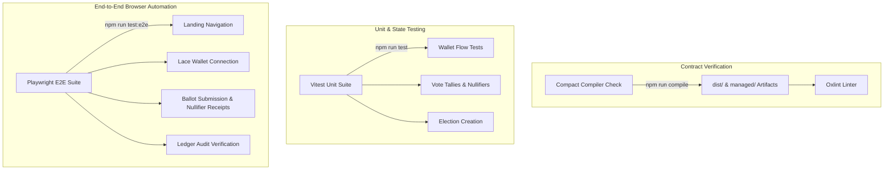

# VoteVault: Testing Strategy & Test Execution Guide

VoteVault implements a rigorous, multi-layered testing strategy combining unit tests, state verification, and end-to-end browser automation.

---

## 1. Test Architecture Summary



---

## 2. Test Execution Commands

### A. Smart Contract Compilation
```bash
cd contract
npm run compile
```
Verifies `index.compact` syntax and generates JS simulator bindings.

### B. Static Code Analysis (Oxlint)
```bash
cd frontend
npm run lint
```
Executes `oxlint` static code analysis across all TypeScript/React source files.

### C. Vitest Unit & State Suite
```bash
cd frontend
npm run test
```
Executes 4 core component and context state test flows:
1. Wallet connection & state update flows
2. Anonymous vote casting, tally increments, and local nullifier generation
3. Historical election outcome audit retrieval
4. Referendum creation and candidate option registration

### D. Playwright End-to-End Browser Suite
```bash
cd frontend
npm run test:e2e
```
Launches headless Chromium to execute end-to-end browser user journeys:
1. Navigation from landing hero to Lace Wallet connection page
2. Selection of ballot options, ZK proof calculation simulation, and receipt generation
3. Results audit page inspection verifying participation timeline charts and spent nullifier tables

---

## 3. Automated Test Results

```text
Vitest Unit Tests:
 ✓ src/tests/VoteVault.test.tsx (4 tests) 3466ms
     ✓ 1. Wallet Connection Flow
     ✓ 2. Vote Casting Test
     ✓ 3. Result Verification Test
     ✓ 4. Election Creation Test
 Test Files  1 passed (1)
      Tests  4 passed (4)

Playwright E2E Tests:
Running 3 tests using 1 worker
  [1/3] [chromium] › tests/e2e.spec.ts: Wallet Connection Flow
  [2/3] [chromium] › tests/e2e.spec.ts: Voting Flow
  [3/3] [chromium] › tests/e2e.spec.ts: Results Flow
  3 passed (15.0s)
```
